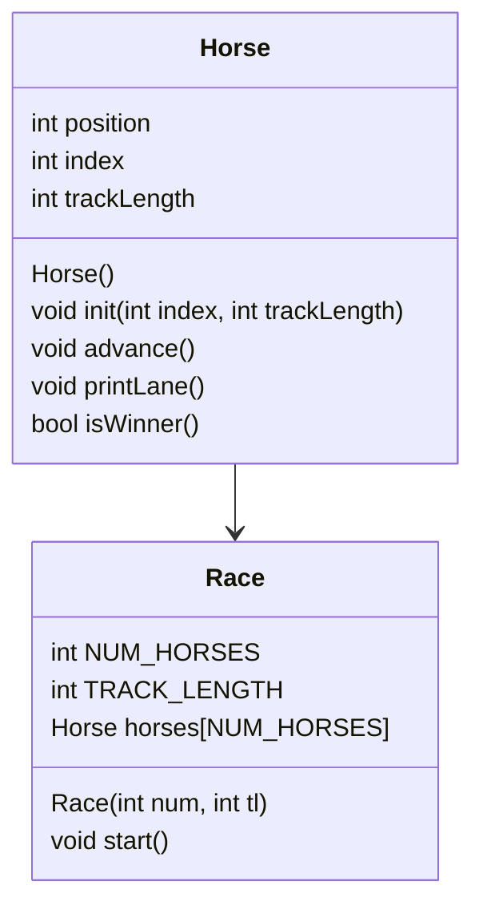

# CS121P5
Object-Oriented Programming Horse Race
By Adithya Ganesan
## UML

## Algorithm
### Horse::Horse()
```
set position 0
set index 0
set trackLength 15
```
### void Horse::init(int index, int trackLength)
```
set position 0
set Horse::index = index
set Horse::trackLength = trackLength
```
### void Horse::advance()
```
int rand = random number 0-1
rand += position
```
### void Horse::printLane()
```
for(int i = 0; i < trackLength)
	if i == position
		print(index)
	else
		print('.')
print(newline)
```
### bool Horse::isWinner
```
if position >= trackLength
	return true
	print(winning commentary)
return false
```
### Race::Race()
```
const static int NUM_HORSES = 5
const static int TRACK_LENGTH = 15

seed random generator

initialize horses array
for Horse h : horses
	initialize index and track length
```
### void Race::start()
```
bool winner = false;
while(winner){
	for Horse h : horses
		h::advance()
		h::printLane()
		if Horse::isWinner()
			winner = false;
}
```


